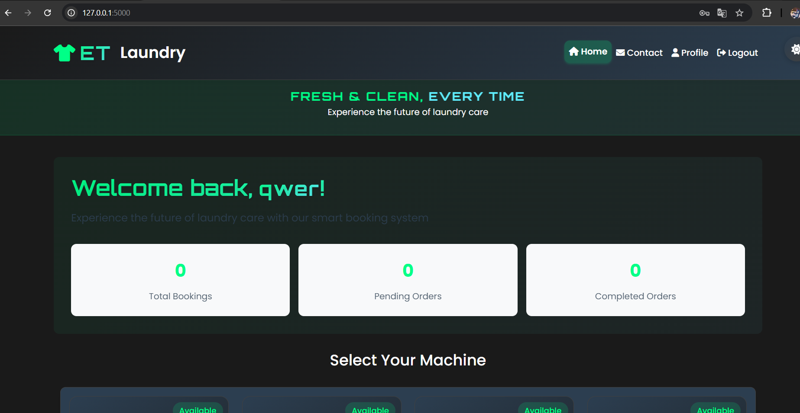

# ESWAR TEJA CHANDRA - Portfolio Website

Welcome to my personal portfolio website! This site showcases my skills, projects, and experience as a Data Scientist and Developer.

## 🚀 Features
- Modern, responsive design with a beautiful dark theme
- Animated hero section with particle background
- About section with profile photo
- Skills section with animated progress bars
- Projects section with real screenshots
- Experience and education timeline
- Contact form with floating labels
- Theme toggle (dark/light)
- Scroll-to-top button
- Smooth scrolling and interactive animations

## 📸 Preview


## 🛠️ Tech Stack
- HTML5, CSS3 (Flexbox, Grid, Animations)
- JavaScript (ES6+)
- [particles.js](https://vincentgarreau.com/particles.js/)
- Responsive design for all devices

## 📂 Project Structure
```
├── index.html
├── styles.css
├── script.js
├── profile.jpg
├── et-laundry-screenshot.png
└── README.md
```

## 📝 Setup & Usage
1. **Clone the repository:**
   ```bash
   git clone <your-repo-url>
   cd <your-repo-directory>
   ```
2. **Open `index.html` in your browser.**

## 🌐 Deployment
You can deploy this site using GitHub Pages, Vercel, Netlify, or any static hosting provider.

- **GitHub Pages:**
  1. Push your code to a GitHub repository.
  2. Go to repository settings > Pages > Source: `main` branch > `/root`.
  3. Visit the provided URL to see your live site.

## 🙋‍♂️ About Me
**ESWAR TEJA CHANDRA**  
Data Scientist | Python Developer | ML Engineer  
Guntur, Andhra Pradesh, INDIA

- [LinkedIn](#)
- [GitHub](#)
- [Email](mailto:eswartejachandra@gmail.com)

---

> Built with ❤️ and code. Feel free to fork, use, and connect! 